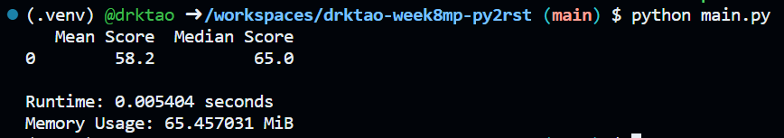
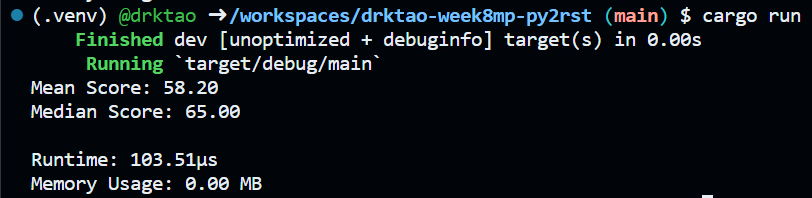

# IDS 706 Week 8 Mini-Project
The purpose of this project is to compare the performance of some simple data processing operations in Python and Rust. The data set used contains all Robert De Niro movies and their corresponding Rotten Tomatoes scores. I calculated and displayed the mean and median of these scores and examined the speed and memory usage in Python and Rust. 

## Instructions
Use Github codespaces, which will allow for a container to be built with the required packages, as detailed in requirements.txt. One can run the data processing steps in Python using `python main.py` in the terminal, and one can run the steps in Rust using `cargo run`. In both cases, the mean and median scores will be displayed, as well as runtime and memory usage.

## Performance Comparison Report
Below, I have displayed the performance metrics from Python and Rust.

We can observe that Rust performs the data processing operations much faster than Python, while also using less memory.
